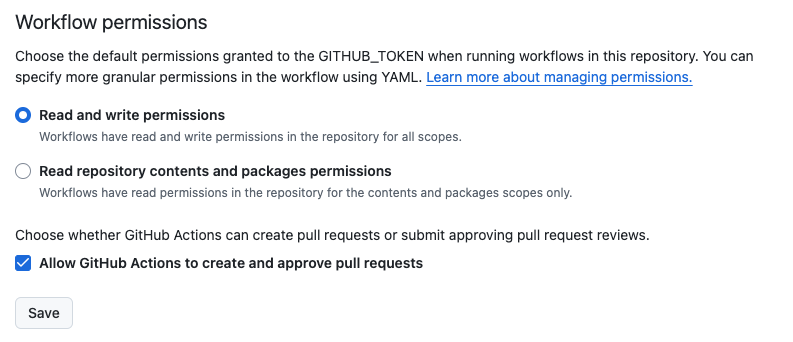

# Test GitHub Actions

## Prepare Docker on Mac

### Use Dokcer desktop


1. Re-nstall docker desktop. Download ```Docker.dmg``` from t
   
   ```https://docs.docker.com/desktop/setup/install/mac-install/```

   My Mac is with Intel chip.

2. Start docker service. Click on Docker.app

3. Check if docker service is running

```
   > docker run hello-world
```

4. Further check.
```
   docker ps
   docker images
```

<!-- ------------------------------  -->
## Write Dockerfile

When I want to test the communication between containers, I often
need a small test container that is fully equipped network tools
like ```curl```, ```nslookup``` and so on. In addion, it would be
nice to have ```bash``` and ```vim```.

Then write a ```Dockerfile```


```

FROM alpine:latest
RUN apk update && apk add --no-cache \
    vim \
    bash \
    bind-tools \
    curl && \
    rm -rf /var/cache/apk/*

SHELL ["bin/bash", "-c"]

CMD ["bash"]
```

Build it

```
docker build -t alpine-messer .
```

Test it
```
docker run -it --rm alpine-messer
```
then
```
4dfb6e4a500e:/# curl --version
curl 8.11.1 (x86_64-alpine-linux-musl) libcurl/8.11.1 OpenSSL/3.3.2 zlib/1.3.1 brotli/1.1.0 zstd/1.5.6 c-ares/1.34.3 libidn2/2.3.7
....
```

<!-- ------------------------------  -->
## Prepare ```.github/workflows/docker-publish.yml```

```
name: Build and Publish Docker Image

on:
  push:
    branches:
      - main # execute GitHub Actions when a code it pushed to main

env:
  REGISTRY: ghcr.io
  #  IMAGE_NAME: ${{ github.repository }}
#  IMAGE_NAME: $(echo "${{ github.repository }}" | tr '[:upper:]' '[:lower:]' | sed 's/_/-/g')

jobs:
  build:
    runs-on: ubuntu-latest
    permissions:
      id-token: write # OIDC
      packages: write
      contents: read
      attestations: write

    steps:
      # 1. check up codes in repository
      - name: Checkout code
        uses: actions/checkout@v2

      # 2. Log in GitHub Container Registry
      - name: Log in to GitHub Container Registry
        uses: docker/login-action@v2
        with:
          registry: ghcr.io
          username: ${{ github.actor }}
          password: ${{ secrets.GITHUB_TOKEN }}

      # 3. Set image name
      - name: Set image name
        id: set-image-name
        run: |
          IMAGE_NAME=$(echo "${GITHUB_REPOSITORY}" | tr '[:upper:]' '[:lower:]' | sed 's/_/-/g')
          echo "::set-output name=image_name::$IMAGE_NAME"

      # 4. Extract metadata (tags, labels) for Docker
      - name: Extract metadata for Docker
        id: meta
        uses: docker/metadata-action@v2
        with:
          images: ${{ env.REGISTRY }}/${{ steps.set-image-name.outputs.image_name }}

      # 5. Build Docker image
      - name: Build and push Docker image
        id: push
        uses: docker/build-push-action@v2
        with:
          context: .
          push: true
          tags: ${{ steps.meta.outputs.tags }}
          labels: ${{ steps.meta.outputs.labels }}

      # 6. Generate artifact attestation
      - name: Generate artifact attestation
        uses: actions/attest-build-provenance@v2
        with:
          subject-name: ${{ env.REGISTRY }}/${{ steps.set-image-name.outputs.image_name }}
          subject-digest: ${{ steps.push.outputs.digest }}
          push-to-registry: true

```
<!-- ------------------------------  -->
## Make sure Workflow permission
is like this.


<!-- ------------------------------  -->
## Push ```docker-publish.yml```
```
git add .
git commit -m "Update docker-publish.yml```
git push origin main
```

<!-- ------------------------------  -->
## Check log

Your repository -> Actions -> click on commit

<!-- ------------------------------  -->
## Check if image is properly

```
docker pull ghcr.io/megnergit/github-actions-alpine-g1:main
main: Pulling from megnergit/github-actions-alpine-g1
....

docker images
REPOSITORY                                   TAG       IMAGE ID       CREATED          SIZE
ghcr.io/megnergit/github-actions-alpine-g1   main      c1303a483492   13 minutes ago   51.2MB

....
```
Okay, done.

<!-- ------------------------------  -->

# END

<!-- ####################  -->
